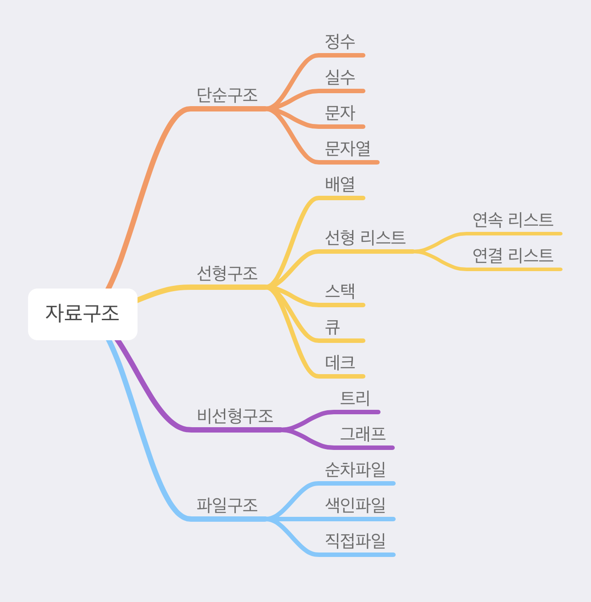

## 😀 2022.03.23.수 

<br />

# ✨자료구조와 알고리즘

## ✔ 자료구조의 종류

[이미지 출처](https://velog.io/@yachae85/%EC%9E%90%EB%A3%8C%EA%B5%AC%EC%A1%B0)  

- 선형 구조: 자료들이 1:1 관계를 갖는 구조이다.
  - ex) Array, Linked List, Stack, Queue
- 비선형 구조: 각 자료들이 다대다 관계를 갖는 구조이다. 
  계층적 구조나 망형 구조를 표현하기에 적합하다.
  - ex) Graph, tree

<br />

## ✔ 시간복잡도 - Big-O notation  

Big-O notation 은 시간 복잡도를 나타내기위한 표기법 중 하나이다.

  
[이미지 출처](https://dev.to/b0nbon1/understanding-big-o-notation-with-javascript-25mc)  

O(n) < O(log(n)) < O(n) < O(nlog(n)) < O(n^2 ) < O(n^2 ) < O(n!)  

### Big-O notation의 4가지 규칙
- 계수 법칙:  
  k가 0보다 클때 f(n) = O(g(n))이면 kf(n) = O(g(n))이다.  
  n이 무한에 가까워질때 k는 의미가 없다. 
- 합의 법칙:  
  f(n) = O(h(n))이고, g(n) = O(p(n))이면 f(n) + g(n) = O(h(n) + p(n))이다.
- 곱의 법칙:
  f(n) = O(h(n))이고, g(n) = O(p(n))이면 f(n) * g(n) = O(h(n) * p(n))이다.
- 다항 법칙:
  f(n)이 k차 다항식이면 f(n)은 O(n^k) 이다.  

**Refer to**: <https://dev.to/b0nbon1/understanding-big-o-notation-with-javascript-25mc>  

<br />

### js에서 성능측정

js로 알고리즘을 풀때 성능측정을 아래와 같이 할 수 있다.  
```js
const start = new Date().getTime()
// ...코드
const end = new Date().getTime()
console.log(start-end)
```

<br />

## ✔ 배열
- 장점
  - index를 통해 원소에 O(1)만에 빠르게 접근이 가능하다
- 단점
  - 새로운 원소를 삽입,삭제하는데 O(n)가 소요되어 느리다
  - 연속된 메모리 상에 원소들이 존재하므로 배열을 선언만큼 데이터를 저장하지 않을 경우 메모리 낭비가 발생한다.  
  
**Refer to**: <https://choheeis.github.io/newblog//articles/2020-12/data-structure-array>

<br />

## ✔ 연결리스트

연결 리스트는 각요소를 포이터로 연결하여 관리하는 선형 자료구조이다.   
각 요소는 노드 라불리고 데이터영역과 포인터영역으로 구성되어 있다.  
첫번째 요소를 Head라고 부른다.  
Singly Linked List, Doubly Linked List, Circular Linked List 가 존재한다.  

- 장점
  - 동적으로 메모리 사용이 가능하므로 메모리를 효율적으로 사용할 수 있다.
  - 데이터 재구성이 용이하다.
  - 대용량의 데이터를 처리하는데 적합하다.
- 단점
  - 특정 위치의 데이터를 검색할때 O(n)이 소요된다.
  - 메모리를 추가적으로 사용해야한다.  

**Refer to**: <https://sycho-lego.tistory.com/17>

<br />

### ▪ Singly Linked List : 가장 단순한 형태의 연결 리스트 이다.
연결리스트의 마지막이 null이다.

  
[이미지 출처](https://velog.io/@eddy_song/dummy-node-in-linked-list) 

- 요소 찾기: 특정 데이터를 찾기 위해서는 Head부터 순차적으로 탐색을 한다. O(n)
- 요소 추가: 데이터를 노드 사이에 추가할 경우 각 링크를 끊어내고 요소를 추가해 포이터를 다시연결시켜주면 된다. O(1)
- 요소 삭제: 삭제할 요소뒤의 데이터가 삭제할 요소 앞의 노드를 가리키게 한 후 삭제할 요소를 제거하면된다. O(1)

<br />

### ▪ Doubly Linked List
양방향으로 이어지는 연결 리스트이다. 

  
[이미지 출처](https://github-wiki-see.page/m/Data-Structure-Study/java-datastructure/wiki/Doubly-Linked-List) 

<br />

### ▪ Circular Linked List
Singly Linked List 또는 Doubly Linked List의 끝이 Head로 연결되는 리스트이다. 

  
[이미지 출처](https://www.alphacodingskills.com/cs/ds/cs-circular-singly-linked-list.php) 
<br />

## ✔ 스택
스택은 LIFO(Last In First Out)의 개념을 갖고 있는 자료구조이다.  
이때 자료를 넣는 것을 push, 꺼내는 것을 pop이라고 한다.  
  
[이미지 출처](https://velog.io/@tiiranocode/자료-구조-스택stack-큐queue) 

<br />

# ✨ 기업과제 
우선 CSS는 어느정도 마무리되었다.  
내일 나머지 api연결하고 redux store만들고 다 할 수 있을 지 모르겠다.  
캘린터 라이브러리 없이 구현해보고 싶었는데 아마 라이브러리 사용해야하지 않을까 싶다.  