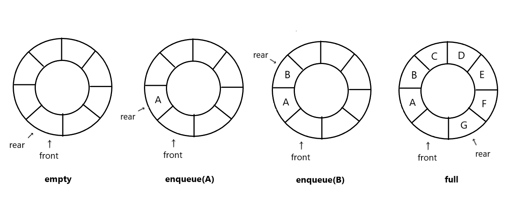
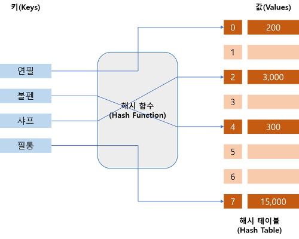
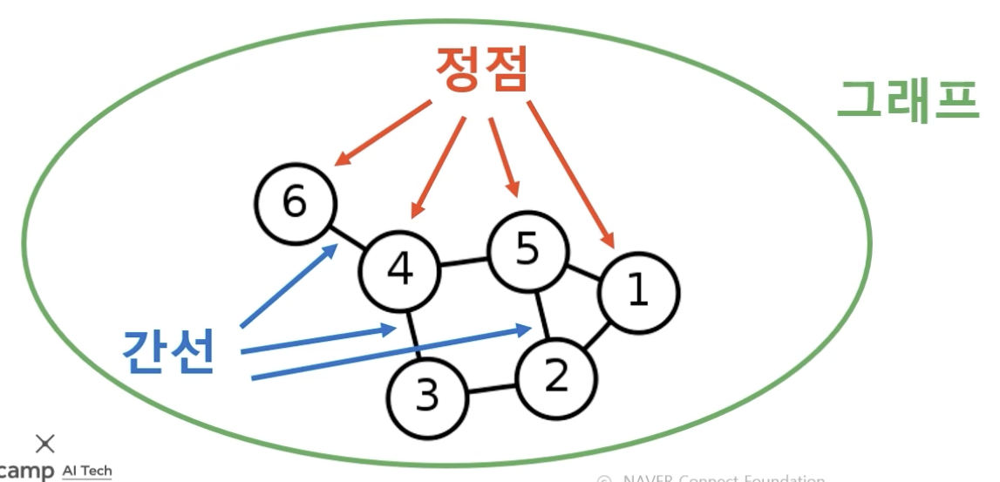

## 😀 2022.03.24.목 

 

# ✨자료구조와 알고리즘

## ✔ 큐
큐는 FIFO(First In Last Out)의 개념을 갖고 있는 자료구조이다.  
큐의 종류는 선형큐 와 원형큐가 있다.

Front: 큐의 가장 앞  
Rear: 큐의 가장 마지막  
DeQueue: Front를 빼내는 것을 의미한다.  
EnQueue: Rear뒤에 데이터를 추가하는 것을 의미한다.  

### 선형 큐

  
[이미지 출처](https://namu.wiki/w/큐(자료구조))   

선형큐는 DeQueue와 EnQueue를 반복하다보면 앞부분은 공간이 비고, 계속해서 뒤로 추가가 되기 때문에 공간활용을 위해서 DeQueue시 데이터를 한 칸씩 앞으로 당겨주어야한다.   
하지만이런 Linked List로 큐를 구현하면 이런 작업을 하지 않아도 된다.  

> js로 큐를 구현할 때 shift() 함수는 선형 시간이 걸리기때문에 큐에서 기대되는 로직이 수행되지 않는다. 
> 그렇기 때문에 shift()사용은 맞지 않다.

 

### 원형 큐
  
[이미지 출처](https://velog.io/@jxlhe46/자료구조-큐-Queue)  

 

## ✔ 해시테이블
key와 value를 받아 저장하는 자료구조이다.  
빠르게 데이터를 검색할 수 있는 것이 특징이다 - O(1).  

> 해시함수: 입력받은 값을 특정 범위 내 숫자로 변경해주는 함수이다 .  

  
[이미지 출처](https://dev-kani.tistory.com/1)  

해시테이블의 문제점은 key를 해싱했을때 값이 같을 수 있다는 것이다. (해시충돌)  
이를 해결하기위한 방법으로 몇개가 있다.
- 선형 탐사법 : 충돌이 발생하면 옆으로 한 칸 이동한다.
- 제곱 탐사법 : 충돌이 발생하면 충돌이 발생한 횟수의 제곱만큼 옆으로 이동한다.  
- 이중 해싱: 충돌이 발생하면 다른 해시함수를 이용한다.  
- 분리 연결법 : 버킷의 값을 연결 리스크로 사용하여 충돌이 발생하면 리스트에 값을 추가한다.  하지만 이 방법은 최악에 한 버킷만 무한정 늘어날 수 있다는 단점이 있다.    

 

## ✔ 그래프
정점과 정점 사이를 연결하는 간선으로 이루어진 비선형 자료구조 이다.  
정점집합(Node)과 간선집합(Edge)으로 표현이된다. 

  
[이미지 출처](https://velog.io/@narastro/코테-그래프)  

- 그래프는 여러개의 간선을 갖을 수 있다. 
- 간선에 가중치를 추가가할 수 있다.
- 사이클이 발생할 수 있다. 
- 간선의 방향성 존재여부에따라 방향 그래프와 무방향 그래프로 나뉜다.  

  |종류|설명|
  |:---:|---|
  |무방향 그래프 |간선을 두고 양방향으로 이동할 수 있다. |
  |방향 그래프   |간선에 방향성이 존재하며 그 방향대로만 이동이 가능하다.  |  

- 연결성에 따라 연결 그래프   

  |종류|설명|
  |:---:|---|
  |연결 그래프|모든 정점으로 이동이 가능한 경우|
  |비 연결 그래프|정점(하나 또는 그 이상)에 접근 가능한 간선이 없는 경우|
  |완전 그래프|모든 정점끼리 이동이 가능한 경우|
  |사이클|그래프의 정점과 간선이 순화되는 부분 |

 

# ✨ 기업과제 

 

# ✨ 회고
- 오늘 알고리즘 문제중에 2번째 해시태그 문제를 못풀었다.  
해설강의를 보면 방식 자체는 내가 생각한 것 과 같은 방식이였다.  
그치면 구현하지를 못했다.  
강의에서 사용된 set, new Map(), flatMap()은 내가 잘 모르는 함수들이였다.  
기업과제 끝나고 공부를 해봐야겠다.  