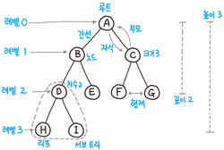
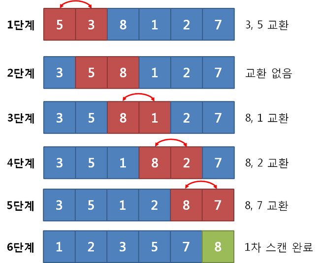

## 😀 2022.03.28.월

 

# ✨ 트리 
트리는 방향 그래프의 일종으로 root라는 정점을 갖고 있다.  
루트에서 특정 정점으로 가는 경로가 1가지이다.   

  
[이미지 출처](https://namu.wiki/jump/0ey6tTH8La%2FHjBTWHVjMCg9HifacgbfUxLja86MHABazzfvf6rhA0WK%2BupMzoBHF) 

트리의 종류를 나누면 이진트리, 완전이진트리, 포화이진트리, 편향트리가 있다. 
- 이진트리: 노드의 최대 간선이 2개인 트리
- 완전 이진 트리: 마지막 레벨을 제외하고 모든 레벨이 꽉 채워져 있다.
- 포화 이진 트리: 마지막 레벨까지 꽉 채워져 있다. 
- 편향 트리: 모든 노트가 root기준 왼쪽 혹은 오른쪽에 편향되어 있다.

 
# ✨ 힙
이진트리 형태를 가지며 우선순위가 높은 요소가 먼저 나갈수 있도록 요소 삽입과 삭제 시에 정렬이 일어난다. 
완전 이진 트리의 형태를 띠어야하고 root에는 가장 우선순위가 높은 요소가 위치한다.  
root가 가장 큰 값을 갖을 경우 최대힙(Max Heap) 가장 작은 값을 갖는 경우는 최소힙(Min Heap)이라고 한다.  

- 노드 추가 
    
   
- 노드 제거  
    
[이미지 출처](https://namu.wiki/w/힙%20트리?from=힙) 

 

# ✨ 트라이
트라이는 문자열을 저장하고 효율적으로 탐색하기 위한 트리형태의 자료구조이다.  
문자열을 탐색할때 단순하게 비교하는 것 보다 효유적으로 찾을 수 있지만, 정점이 자식에 대한 링크를 전부 갖고 있기 때문에 저장 공간을 많이 사용한다.   
해시 테이블과 연결리스트로 이를 구현할 수 있다.  
  
[이미지 출처](https://rebro.kr/86)  

 

# ✨ 정렬
정렬의 기준은 사용자가 정할 수 있다.  
크게 비교식과 분산식으로 나눌 수 있다.  
삽입, 선택, 버블, 머지, 힙, 퀵 정렬 등 다양한 형태의 정렬 방식이 존재한다.  
- 비교식 정렬: 다른 요소와의 비교를 통해 정렬을 한다. 
  - 버블 정렬: 서로 인접한 두 요소를 검사하여 정렬하는 알고리즘. O(n^2)
      
    [이미지 출처](https://wonjayk.tistory.com/219)  
  - 선택 정렬: 선택요소와 가장 우선순위가 높은 요소를 교환하는 알고리즘. O(n^2)
      
    [이미지 출처](https://wonjayk.tistory.com/217)  
  - 삽입 정렬: 선택한 요소를 삽입 할 수 있는 위치를 찾아 삽입하는 방식의 알고리즘. O(n^2)
      
    [이미지 출처](https://wonjayk.tistory.com/218)   

- 분산식 정렬: 문제를 작은 2개의 문제로 분리하고 더 이상 분리가 불가능할때 처리한 후 합치는 전략
  - 합병 정렬: 분할 정복 알고리즘을 이용한 최선과 최악이 같은 안정적인 정렬 알고즘. O(nlog n)
      
    [이미지 출처](https://wonjayk.tistory.com/221)   
  - 퀵 정렬: 분할 정복 알고리즘을 이용한 매우 빠르지만 최악의 경우가 존재하는 불안정한 정렬. O(nlog n)
      
    [이미지 출처](https://gmlwjd9405.github.io/2018/05/10/algorithm-quick-sort.html)  

 

# ✨ BFS,DFS
- BFS: 그래프 탐색 알고리즘으로 같은 깊이에 해당하는 정점부터 탐색해가는 알고리즘이다.  
  - 큐를 이용해 구현할 수 있다.  
  - 시작 지점에서 가까운 정점부터 탐색을 한다.  
  - V가 정점의 수, E가 간선의 수일 때 시간 복잡도는 O(V+E)이다.
- DFS: 그래프 탐색 알고리즘으로 최대한 깊은 정점부터 탐색하는 알고리즘이다.
  - 스택을 이용해 구현할 수 있다. 
  - 시작정점에서 깊은 곳 부터 탐색을 한다. 
  - V가 정점의 수, E가 간선의 수일 때 시간 복잡도는 O(V+E)이다.
