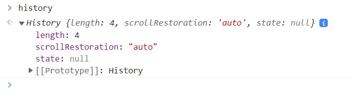

## 😀 2022.04.06.수

<br/>

# ✨ history API

- 브라우저에서 페이지를 로딩하면 세션 히스토리를 갖게된다. 
  세션 히스토리는 페이지를 이동할 때마다 쌓이게 되며 이를 통해 뒤로가기, 앞으로가기 등 이동이 가능해 진다.
- 일반 url형식을 따르기 때문에 querystring도 자유롭게 붙일 수 있게 된다.
- pushState: 세션 히스토리에 새 url 상태를 쌓는다.
- replaceState: 세션 히스토리에 새 url 을 쌓지 않고 현재 url을 대체한다.
  ex) form 작성완료 후 요청을 보내고 다시 뒤로가기를 했을때 동작을 방지하는 용도
- history api로 url을 변경한 후 새로고침 시 변경된 url의 실제 파일을 찾으려 하기 때문에 404에러가 난다.
  -> 이때 404 애러가 났을 경우 root의 index.html로 요청을 돌려주는 처리가 필요하다.

```js
history.pushState(state, title, url)
history.replaceState(state, title, url)
// state: history.state에서 꺼내 쓸 수 있는 값
// title: 짧게 상태에대한 제목을 제공(대부분의 브라우저가 title 변수를 무시해서 빈문자열로 작성한다.)
// url: 세션 히스토리에 새로 넣을 url, a태그를 클릭하거나 location.href로 url을 변경한 것 과는 다르게 화면이 리로드 되거나 하지 않는다.
```


- length: 지금까지 쌓여있는 히스토리 갯수
- scrollRestoration: 기록 탐색 시 스크롤 위치의 복원여부(auto, manual)
- state: 기록 스택 최상단의 스테이트를 나타내는 값
<https://developer.mozilla.org/ko/docs/Web/API/History>

```js
// router로 path에 따라 보여줄 페이지 지정
function route() {
  const { pathname } = location;
  const $container = document.querySelector("#container");
  if (pathname === "/") {
    $container.innerHTML = "Home";
  } else if (pathname === "/product-list") {
    $container.innerHTML = "<h1>상품목록</h1>";
  } else if (pathname === "/article-list") {
    $container.innerHTML = "<h1>개시글 목록</h1>";
  }
}
route();

// a태그를 방지하고 history 사용
window.addEventListener("click", (e) => {
  if (e.target.className === "linkItem") {
    e.preventDefault(); // a태그 페이지 이동 방지

    const { href } = e.target; // path로 href 가져오기
    const path = href.replace(window.location.origin, "");

    console.log(path);

    history.pushState(null, null, path); // history로 리랜더 없이 url 변경
    route();
  }
});

// 뒤로가기 앞으로가기 했을때 동작하도록 rounte()실행
window.addEventListener("popstate", () => route());
```
