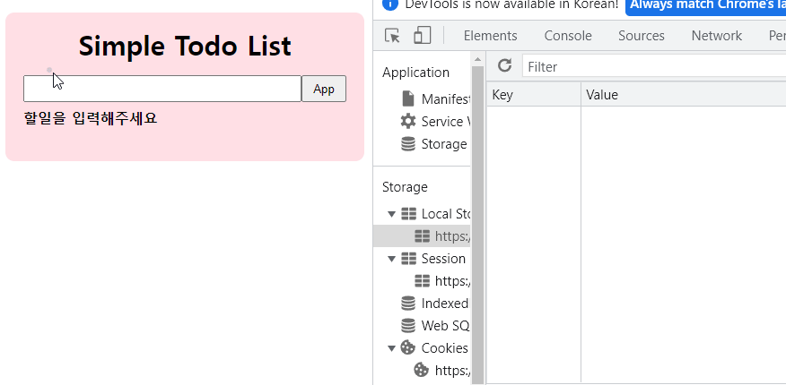

## 😀 2022.04.07.목

 

# ✨ 프로그래머스 과제수행

vanillaJS로 todoList 구현

<https://symphonious-cat-6669ef.netlify.app/>

# ✨ 회고

오늘 프로그래머스 과제 마무리를 지었다.  
시간이 없어서 우선 과제에서 요청된 사항까지만 했다.  
vanillaJS로 구현하는걸 어렵게만 생각했는데 어느정도 패턴을 아니까 할만 한 것 같다.  
물론 React보다는 훨씬 불편하기는 하지만 나중에 과제가 주어졌을때 이전과 달리 시도해볼 수 있을 것 같다.  
