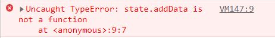

## 😀 2022.04.13.수

<br/>

# ✨ 정보 은닉
이번에 vanilla JS를 하면서 리덕스처럼 state를 은닉화하고 전역으로 관리하고 싶었다. 
변경시에도 함수를 통해서만 변경하도록.  
그런데 그 동안 redux를 나름 잘 써왔다고 생각했지만 이걸 구현 하려니 redux에서 무슨일을 해주는거지?  
하는 생각이 들고 코드에 뭘 작성해야할지 머리가 하얘졌다.  
알고있다고 생각했는데 전혀 아니였던것 같다.  
초반에 action과 reducer를 만들며 형식을 비슷하게 따라해봤지만 그렇게 해서 구현하려면 많은 시간이 걸릴 것 같아서 가장 필요한 전역관리와 은닉, 함수를통해서만 state변경 이것만 가져가기로 했다.  
그 과정에서 이전에 백엔드를 하셨던 분에게 여쭤봐서 방법을 찾았다.  
찾는과정에서 글로만 봐서 이해하지 못했던 this나 new, function 함수에대한 조각지식을 얻을 수 있었다.  

처음에 아래와 같이 작성했다.  
```js
function state () {
  let data = 1
  this.addDate = () => {
    data++
    return data
  }
}
state.addData()
```

이런 오류메시지를 볼 수 있었다.  

다음에는 클로저를 이용해서 하면 되지 않을까? 하는생각에 아래와 같이 작성했다.  
```js
function state () {
  let data = 1
  return {
    addData: () => {
      data++
      return data
    }
  }
} 
state.addData()
```
ㅎㅎ 결과는 마찬가지였다.  
왜 function이 아니라고 하는거지?? 하면서 찾아봤다.  

아래 클로저를 사용한 함수의 state를 콘솔찍어보니 함수 실행후 return에 있는 메서드를 가져왔어야했는데 실행 없이 바로 불러서 오류가 났었다.  
체이닝으로 바로 실행 시키고 싶으면 아래와 같이 작성하니 잘 동작했다.  
```js
const state = (() => {
  let data = 1
  return {
    addData: () => {
      data++
      return data
    }
  }
})()
state.addData()
```
위에 this를 사용할 경우에는 new를 통햇 생성 후 사용해야 했다.  
```js
function state () {
  let data = 1
  this.addDate = () => {
    data++
    return data
  }
}
const newState = new state()
newState.addData()
```
그동안 new라던가 객체 class를 직접 쓸 일이 없어서 잘 안썼더니 이에 대한 이해가 부족했었고, 관련 지식을 읽어도 흥미가 가지 않았는데 이번 개기로 공부해보고 싶다는 마음이 들었다.  

# ✨ 커피챗 
 이번 커피챗 시간에는 개인,미니프로젝트진행에 대한 이야기를 나누었다.  
내가 했던 질문은 어떻게하면 중간에 프로젝트가 중간에 터지지 않고 끝까지 완료할 수 있을지에 대한 질문을 했다.  
그리고 맨토님은 어떤 미니프로젝트로 어떤 주제로 프로젝트를 하셨는지에 대해 여쭤봤다.  
 먼저 프로젝트가 터지지 않게 하기위해서는 프로잭트원들을 잘 뽑는것 밖에 없다고 하셨다.   
동기가 맞는 사람들 (이번에 무조건 취업해야하는 사람들)과 같이 하면 된다! 가 답변이였다.  
이어서 사람들의 동기에대한 말을 해주셨는데 그 이야기가 인상적이였다.  
사람들이 보통 돈을내고 프로젝트를 시작하면 돈을 냈기 때문에 더 열심히 할거라고 생각하지만 돈을 냄으로써 프로젝트에서 나올때 더 부담없이 더 많이 중간에 빠지는것 같다는 이야기 였다. 나도 뭔가 강제성을 부여할 때 돈을 내면 해결되지 않을까라는 생각을 많이 하고는 했는데 오히려 그게 더 그 일에 대한 동기를 해칠 수 있겠다는 생각을 하게 되었다.  
 다음으로 미니프로젝트 주제는 크게 세가지로 내가 필요해서 만들거나, 다른사람들이 필요해 하지 않을까? 라는생각에 만드는것, 다른 타 서비스가 좋아보여서 혹은 여기에대한 아쉬운점을 보안해서 만드는 클론작업 이렇게 세개중에 골라서 하고, 프로젝트시 새로운 기술2가지 정도 도입해서 작업하신다고 했다.  
들으면서 갑자기 해보고싶은 프로젝트들이 떠올라서 한동안 주제가 없어서 고민할일은 없을 것 같다.  

# ✨ 회고

어제,오늘 프로그래머스에 가서 실습을 진행했다.  
첫날에는 우왕좌왕 하다가 끝났고, 오늘은 지금 같은조원분들 그리고 임시조원분들과 보다 많은 이야기를 나눌 수 있었다.  
지금 조원과는 서로 모른걸 질문하고 알아가고 했던 시간이였다.  
사람들과 서로 모르는걸 공유하고 같이 찾아가고 공부했던게 혼자 공부했을 때보다 재미있었고 의욕도 많이 났다.  
찾아서 알려줬을때 뭔가 도움이 된것 같아서 매우 뿌듯햇고, 평소 너무 재미없어서 공부하기 꺼렸던 정보은닉, 클로저, this이런 개념을 조금이나마 이해할 수있었고 공부하기 싫다는 마음대신 흥미를 가져갈 수 있었다.  
임시조원 분들과는 요즘 개인프로젝트에대한 이야기, 시시콜콜한 잡담을 했다.  
이전에 온라인으로만 보다가 이렇게 대면으로 만나서 이야기를 나누니 더 친해진 것 같고 좋았다.  