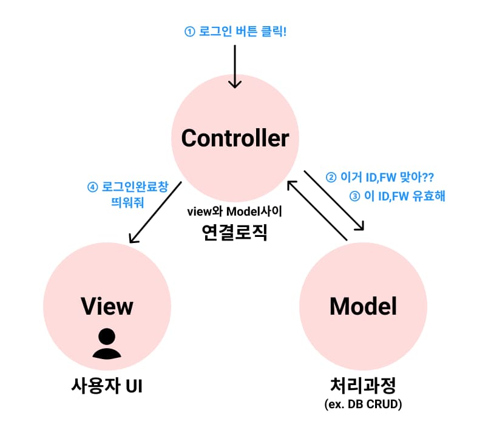

## 😀 2022.04.15.금

<br/>

# ✨ MVC 패턴

기존에 UI와 비즈니스로직 데이터를 같이 다루다보니 복잡도가 올라갔다.  
이에따라 유지보수, 업데이트가 어려워져서 이 복잡도를 낮추고자 여러 디자인 패턴들이 나오기 시작했다.  
이런 디자인 패턴을 지키며 소프트웨어의 규모가 커져도 디자인패턴 내에서 커져서 복잡도가 증가되지 않는 효과를 기대할 수 있게 되었다.  



Model - View - Controller 패턴

- 모델 
  - 무엇을 할지를 정의한다. 
  - 처리 과정, DB의 CRUD
- 뷰 
  - 보여주는 역할
  - 사용자 UI
- 컨트롤러 
  - 어떻게 처리할지를 알려주는 역할이다.  
  - 모델과 뷰사이간의 연결성 로직 

MVC 패턴은 위 그림을 보다시피 서버가 바뀌면 클라이언트도 영향을 많이 받게 된다.  

하지만 요즘 나온 어플리케이션을 보면 클라이언트의 로직이 훨씬 커지고 뷰도 많아지는 추세이다.  
그러면서 서버의 영향을 많이 받는 MVC 패턴에서 클라이언트에서 상태를 갖고 상태를 유지할 수 있는 
MVVM패턴이 나왔다.  

<https://medium.com/@jang.wangsu/디자인패턴-mvc-패턴이란-1d74fac6e256>

<br />

# ✨ curry

커링은 f(a,b,c)처럼 단일 호출로 처리하는 함수를 f(a)(b)(c)와 같이 각각의 인수가 호출 가능한 프로세스로 호출된 후 병합되도록 변환하는 것이다.  

```js
// (기존)
const add = (a,b) => a+b
add(1,2) // 3

// (curry)
const addCurry = (a) => (b) => a+b
addCurry(1)(4) // 5
const add10 = addCurry(10) // 10 + b
add10(3) //13

```

아직 이런 방식이 있구나 까지만 알겠고, 언제 쓰일지는 감이 잘 안온다.  
함수형 프로그래밍과 관련이 있어보인다.  

<https://ko.javascript.info/currying-partials>
<https://perfectacle.github.io/2017/06/30/js-func-07-curry/>

<br />


# ✨ 회고

오늘 상태관리를 하고 어떻게 그 상태를 구독하는지에 대해서 배웠고, 중간에 비동기함수를 어떻게 상태관리를 해주는지에 대해서 공부했다.  구지 이렇게까지 해야해? 싶었는데 그렇게 상태관리해주고 action으로 데이터를 변경해주는게 MVVM패턴 이라고 하는 것 같다. 아마도?  
이번에 이렇게 구현해보고 MVVM패턴에대한 질문도 해볼까 싶다.
