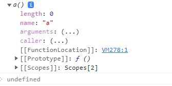

## 😀 2022.04.21.화

<br/>

# ✨ 프로퍼티 어트리뷰트

## ✔ 내부 슬롯과 내부 메서드



- `[[]]` 로감싼 이름들을 내부 슬롯 내부 메서드 라고한다.
- js엔진에서는 실제 동작을 하지만 개발자가 사용할 수 있도록 **공개된 프로퍼티는 아니다.** 즉! 외부에서 접근하거나 호출할 수 있는 방법을 제공하지 않지만 내부메서드에 한해서 간접접근이 가능하다.

ex) 모든 객체는 `[[Prototype]]`이라는 내부 슬롯을 갖고 `__proto__`로 간접적으로 접근이 가능하다.

## ✔ 프로퍼티 어트리뷰트와 프로퍼티 디스크립터 객체

**js엔진은 프로퍼티를 생성할 때 프로퍼티의 값, 값의 개인 가능 여부, 열거가능 여부, 재정의 가능여부(프로퍼티의 상태)를 나타내는 프로퍼티 어트리뷰트를 기본 값으로 자동 정의한다.**

프로퍼티 어트리뷰트
프로퍼티 디스크립터

## ✔ 데이터 프로퍼티와 접근자 프로퍼티

```js
const store = {
  item: "banana",
  itemPrice: 5000,

  get display() {
    return `${this.item}의 가격은 ${this.itemPrice} 입니다.`;
  },

  set priceChange(price) {
    this.itemPrice = price;
  },
};

console.log(store.display); // banana의 가격은 5000 입니다.
store.priceChange = 7000;
console.log(store.display); // banana의 가격은 7000 입니다.

let descriptor = Object.getOwnPropertyDescriptor(store, "item");
console.log(descriptor);
/*
  {
    value: 'banana',
    writable: true,
    enumerable: true,
    configurable: true
  }
*/
descriptor = Object.getOwnPropertyDescriptor(store, "priceChange");
console.log(descriptor);
/*
  {
  get: undefined,
  set: [Function: set priceChange],
  enumerable: true,
  configurable: true
}
*/
```

> getOwnPropertyDescriptor : 객체의 프로토타입 체인을 따라 존재하는 덕택에 제공하는 게 아닌 객체에 직접 제공하는 속성  
> [MDN:getOwnPropertyDescriptor](https://developer.mozilla.org/ko/docs/Web/JavaScript/Reference/Global_Objects/Object/getOwnPropertyDescriptor)

- 프로퍼티는 데이터 프로퍼티와 접근자 프로퍼티로 구분할 수 있다.
- **데이터 프로퍼티**
  키와 값으로 구성된 일반적인 프로퍼티이다.

  | 프로퍼티<br>어트리뷰트 | 프로퍼티 디스크립터<br> 객체의 프로퍼티 | 설명                                                                                          |
  | :--------------------: | :-------------------------------------: | --------------------------------------------------------------------------------------------- |
  |       [[Value]]        |                  value                  | - 반환되는 값                                                                                 |
  |      [[Writable]]      |                Writable                 | - 값의 변경여부(bool)                                                                         |
  |     [[Enumerable]]     |               Enumerable                | - 프로퍼티의 열거 가능여부(bool)<br>- for...in문이나 Object.keys메서드등을 사용할 수 없다.    |
  |    [[Configurable]]    |              Configurable               | - 프로퍼티 재정 가능 여부(bool)<br>- 해당 프로퍼티의 삭제, 프로퍼티 어트리뷰트 값 변경이 금지 |

  (단, [[Writable]]이 true인 경우 [[Value]]의 변경과 [[Writable]]을 false로 변경하는 것은 허용 )

- **접근자 프로퍼티**
  접근자 프로퍼티는 자체적으로 값을 갖지 않고 다른 데이터 프로퍼티의 **값을 읽거나 저장**할 때 사용하는 **접근자 함수**로 구성된다.
  | 프로퍼티<br>어트리뷰트 | 프로퍼티 디스크립터<br>객체의 프로퍼티 | 설명 |
  |:--:|:---:|--|
  |[[Get]]|get|접근자 프로퍼티를 통해 데이터 프로퍼티의 값을 읽을 때 호출되는 접근자 함수|
  |[[Set]]|set|접근자 프로퍼티를 통해 데이터 프로퍼티의 값을 저장할 때 호출되는 접근자 함수|

> 프로토 타입(protoType)  
> 어떤 객체의 상위 객체의 역할을 하는 객체이다. 프로토타입은 하위 객체에게 자신의 메서드를 상속해 하위에서 자유롭게 사용할 수 있게 된다.

접근자 프로퍼티와 데이터 프로퍼티 구별방법

```js
// 일반 객체의 __proto__는 접근자 프로퍼티다.
Object.getOwnPropertyDescriptor(Object.prototype, "__proto__");
// 함수 객체의 prototype은 데이터 프로퍼티다.
Object.getOwnPropertyDescriptor(function () {}, "prototype");
```

## ✔ 객체 변경 방지

- 객체 확장 금지 : Object.preventExtensions
  확장이 금지된 객체는 프로퍼티 추가가 불가능하다.

- 객체 밀봉 : Object.seal
  읽기와 쓰기만 가능해진다.

- 객체 동결 : Object.freeze
  읽기만 가능하다.

- 불변 객체
  직속 프로퍼티만 변경이 방지되고 중첩 객체까지 영향을 주지 못한다.

# ✨ 회고

그 동안 노션 클론코딩때문에 TIL을 하나도 작성하지 못했다.  
대신 주말에 블로그에 노션 클론 코딩에대한 회고를 작성해야 겠다.  
어제 노션 콜론 끝나자마자 금요일 스터디 발표에 밀린것들 하려면 주말에 못 쉴 것 같다. ㅠㅠ
그래도 노션 클론 코딩 하며 피곤했지만 기존에 리액트나 다른 라이브러리에서 제공 받았던 기능들에대해 다시 생각해볼 수있어서 좋은 경험 이였다.
