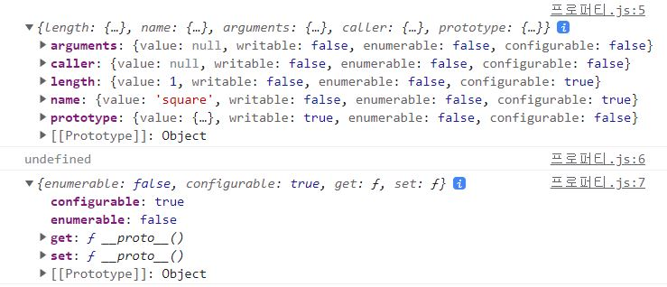

## 😀 2022.04.22.금

<br/>

# ✨ 생성자 함수에 의한 객체 생성

## ✔ Object 생성자 함수

이전에 객체 리터럴에 의한 생성방식은 직관적이고 간편하다. 하지만 이는 하나의 객체만 생성한다.  
생성자 함수를 이용해 객체를 생성하면 같은 구조의 객체를 여러개 생성할 수 있다.

```js
// 생성자 함수
function Monster(name, hp) {
  //인스턴스 초기화
  let HP = hp;
  this.name = name;

  this.hit = function (attack) {
    HP -= attack;
    console.log(`${this.name}의 HP가 ${HP}만큼 남았습니다.`);
    return HP;
  };

  this.heal = function (cure) {
    HP -= cure;
    console.log(`${this.name}가 ${HP}만큼 HP를 회복했습니다.`);
    return HP;
  };
}

// 인스턴스 생성
const monster1 = new Monster("빨간 달팽이", 50);
const monster2 = new Monster("주황버섯", 125);

monster1.hit(20); // HP가 30만큼 남았습니다.
monster1.hit(25); // HP가 5만큼 남았습니다.
```

> 📃 this란?  
> 자기참조 변수로 this가 가리키는 건 함수 호출방식에 따라서 동적으로 결정이 된다.
>
> - 일반 함수로 호출 : 전역 객체
> - 메서드로서 호출 : 메서드를 호출한 객체
> - 생성자 함수로서 호출 : 생성자 함수가 생성할 인스턴스

## ✔ 생성자 함수 인스턴스 생성 과정

1. 인스턴스 생성과 this 바인딩

- 암묵적으로 빈 객체가 생성된다. 이 빈 객체가 인스턴스이다.
- 이 빈 객에에 this가 바인딩되어 내부에서 this가 이 객체를 가리키게된다.

2. 인스턴스 초기화

- this에 바인딩 되어있는 인스턴스를 초기화 한다.
- 코드를 위에서부터 읽어들이며 값을 할당한다.

3. 인스턴스 반환

- 위의 과정이 끝나면 인스턴스가 바인딩 된 this가 암묵적으로 반환된다.
- 만약 this가 아닌 다른 객체를 return 하면 뒤에 return 문이 반환된다.
- 그렇기 때문에 생성자 함수내부에서는 return 문을 반드시 생략해야한다.

```js
function Monster(name, hp) {
  let HP = hp;

  this.name = name;

  this.hit = function (attack) {
    HP -= attack;
    console.log(`${this.name}의 HP가 ${HP}만큼 남았습니다.`);
    return HP;
  };

  return {}; // 🚨생성자 함수 내부에서는 return을 반드시 생략해야한다.
}

console.log(monster); // {}
```

## ✔ [[Call]]과 [[Construct]]

함수는 객체이다. 그렇기 때문에 일반 객체가 갖고있는 내부슬롯, 내부메서드를 갖고 있다.
일반 객체와 다른점이라 하면 함수는 호출이 가능하다는 점이다.

[[Call]] : 함수가 일반 함수로서 호출되면 함수 객체의 내부메서드 Call이 호출된다.
[[Construct]] : new 연산자와 함께 생성자 함수로서 호출되면 내부 메서드 Construct가 호출된다.

## ✔ constructor과 non-constructor

위에서 내부함수 [[construct]]를 갖는 함수객체를 constructor, 갖고있지 않는 함수객체를 non-constructor이라고한다.

- constructor : 함수 선언문, 함수표현식, 클래스
- non-constructor : 화살표 함수

여기서 말하고 싶은건 화살표 함수는 일반 함수들 처럼 new나 this같은 연산자를 사용할 수 없다를 말하고 싶은 것 같다.

## ✔ new 연산자

new 키워드를 사용해서 함수를 호출하면 [[construct]]가 호출되고,  
new 키워드 없이 일반적으로 호출할 경우 [[Call]]이 호출된다. 그러므로 함수 내부에서 가리키는 this는 전역 객체 window를 가리키게 된다.

> 생성자 함수는 첫글자를 대문자로 기술하는 파스칼 케이스로 사용해서 구별하는것이 좋다.

## ✔ new.target(ES6)

바로 위의 설명과 같이 new 키워드 없이 호출이되면 this가 전역 객체를 가리키게 된다.  
이렇게 new 키워드 없이 호출되는 것을 방지하기위해 ES6에서는 new.target을 지원한다.

```js
function Monster(name, hp) {
  // 방어코드
  if (!new.target) {
    return new Monster(name, hp);
  }

  let HP = hp;

  this.name = name;

  this.hit = function (attack) {
    HP -= attack;
    console.log(`${this.name}의 HP가 ${HP}만큼 남았습니다.`);
    return HP;
  };
}

const monster1 = Monster("빨간 달팽이", 50);
```

이렇게 하면 new 키워드 없이도 정상적으로 동작한다.

```js
// 최신문법을 지원하지 않는경우(가령 IE라던가 IE라던가...)
// 이제는 사라진다고해서 아래 방법을 구지 알아야할까 싶지만...
// instanceof는  19장에서...
if (!(this instanceof Monster)) {
  return new Monster(name, hp);
}
```

# ✨ 함수와 일급 객체

일급 객체는 다른 객체들에 일반적으로 적용 가능한 연산을 보드 지원하는 객체를 가리킨다.

1. 무명의 리터럴로 생성할 수 있다. 즉, 런타임에 생성이 가능하다.
2. 변수나 자료구조(객체, 배열 등)에 저장할 수 있다.
3. 함수의 매개변수에 전달할 수 있다.
4. 함수의 반환값으로 사용할 수 있다.
   위의 조건이 모두 만족해야 일급 객체이다.

```js
// 1. 함수는 무명의 리터럴로 생성할 수 있다.
// 2. 함수는 변수에 저장할 수 있다.
const muscleGain = function (num) {
  return ++num;
};

const muscleLoss = function (num) {
  return --num;
};

const muscle = { muscleGain, muscleLoss };

function makeCounter(muscle) {
  let muscleMass = 500;

  return function () {
    // 4. 함수의 반환값으로 사용할 수 있다.
    muscleMass = muscle(muscleMass);
    return muscleMass;
  };
}

// 3. 함수의 매개변수에 전달할 수 있다.
const increaser = makeCounter(muscle.muscleLoss);
console.log(increaser());
console.log(increaser());
```

## 함수 객체의 프로퍼티

```js
function square(number) {
  return number * number;
}

console.log(Object.getOwnPropertyDescriptors(square));
console.log(Object.getOwnPropertyDescriptor(square, "__proto__"));
console.log(Object.getOwnPropertyDescriptor(Object.prototype, "__proto__"));
```



```js
function add(a, b) {
  console.log(arguments); //1,2,3,4
  return a + b;
}
add(1, 2, 3, 4);

console.log(add.length); // 2
console.log(add.name); // add
```

## arguments 프로퍼티

js는 함수의 매개변수와 인수의 갯수가 일치하는지 확인하지 않는다.
따라서 아래와 같은 코드에도 애러가 나지 않는다.

이때 매개변수가 주어지지 않으면 undefined로 할당이 이루어지고,  
매개변수가 초과로 할당될 경우 이는 무시된다.

이때 매개변수가 버려지는것이 아니라 arguments 프로퍼티에 암묵적으로 저장이 된다.

-> 38장 '이터러블',26장 "Rest 파라미터"등 에서 계속...

## caller 프로퍼티

caller프로퍼티는 함수 자신을 호출한 함수를 가리키다.

-> 48장 '모듈'에서 계속...

## length 프로퍼티

매개변수의 개수

## name 프로퍼티(ES6)

함수의 이름을 나타낸다.

## `__proto__`접근자 프로퍼티

모든 객체는 [[Prototype]]이라는 내부슬롯을 갖는다.
여기에 접근하기 위해서는 `__proto__`라는 접근자를 사용해야한다.

-> 19장 프로토 타입 에서 계속...

## prototype 프로퍼티

prototype 프로퍼티는 함수가 객체를 생성하는 생성자 함수로 호출될때 생성자 함수가 생성할 인스턴스 프로토타입 객체를 가리킨다.

-> 19장 프로토 타입 에서 계속...

# ✨ 노션 클로닝 회고

오늘 팀 회고를 했다.  
<https://brunch.co.kr/@hsjcompany/10>블로그에 나온 3Fs방법으로 회고를 진행했다.

## ✔ Fact

컴포넌트 생성, api연결, 라우터 설정, state관리, contentEditable 등 이것들을 다른 라이브러리 없이 vanillaJS로 만드는 프로젝트를 진행했다.

## ✔ Feeling

- 쉽지 않을거라는건 알았지만 생각보다 어려웠다.  
  그동안 라이브러리에서 제공하던 것 들에 대해서 어떤 원리로 동작을 했을까 생각해볼 수 있었다.
- 처음에 컴포넌트를 많이 필요하지 않을까? 하는 생각에 state를 props로 넘겨주지 않고 store에서 관리하자 라고 생각했었다.  
  그런데 vanillaJS로 프로젝트를 하는게 익숙하지 않다보니 파일을 나누는것이 부담이 되었다. 컴포넌트를 나누더라도 재사용할만한 컴포넌트가 딱히 있지 않았고, 있다고 해도 재사용성 있게 깔끔하게 만들 자신이 없없다.  
  그래서 결국 컴포넌트 2개 패이지 1개 라는 그냥 단순하게 데이터를 넘겨줬어도 될만한 그림이 나왔다.
- 라우터 설정에 있어서 새로고침이 동작하지 않았다. 원인은 아직도 찾지 못했다. 아마 새로고침과 동시에 라우터가 돌아가야하는데 그전에 store에서 데이터 세팅하는게 먼저 동작해서 그러지 않을까..? 하는 추측에 store를 싹다 빼고 라우터 먼저 동작하도록 바꿔봤는데도 잘 동작하지 않았다. ㅠㅠ
- toggle은 details 태그를 이용해 재귀로 돌리는 방식으로 쉽게 구현했다. 다만 details에서 재공해주는 삼각형 토글 버튼에 애니메이션이 올라가지 않아서 버튼을 제거하고 따로 만들어주었다. 또한 글씨를 클릭해도 토글이 동작하는 바람에 다른 태그로 그 위에 커버를 씌워주어서 토글이 눌리지 않도록 했다. 그 과정에서 조금 난잡해지지 않았나 싶다.
- 이번에 eventlistener를 다시 배운것 같다. 그냥 eventlistener를 사용하면 알아서 select된 태그에 이벤트가 붙는줄 알았다. 그런데 랜더링이 일어나면서 이벤트가 붙지 않는현상을 봤고, 아직 이벤트에 대한 이해가 부족하다는 것을 느꼈다.
- api는 기존에 자주 쓰던 방식으로 작성했다. 상단에 공통 header 작성해주고 아래 method나 다른 body 값을 전달해 줄 수 있는 함수로 작성했다. 여기에 대해서는 딱히 수정해주고 싶은 사항은 없었다.
- contentEditable 시도는 했지만 너무 어려웠다. 중간에 맨토님이 감사하게도 그대로 복사해서 사용할 수 있도록 코드도 제공해 주셨지만 한번 다시 랜더링 한 후에는 방향키 이벤트가 싹 빠져있어서 다시 이벤트를 붙여주는 작업이 필요했다. 그 이후에 # 의 갯수나 다른 애디터 기능을 추가해야하는데 제출까지 시간이 별로남지 않아서 다음에 다시 해보기로하고 관련 코드는 다 제거한 후 올렸다.

## ✔ Finding

- 기술적인건 공부하고 알아아가면 되는 거지만, 초반에 개발 습관을 다시 잡아야겠다는 생각을 했다. 커밋을 하면서 너무 순서 없이 구현해서 메시지를 적는데에서 고민을 많이 하게 되었다. 코드 작성하기 전에 사전에 생각을 더 많이 해봐야 할 것 같다.

## ✔ Future Action

- 우선 이번 과제를 하며 이론적으로 이해가 부족했던 eventlistener를 공부하고, 기본기능에 대한 오류사항(evnet)에 대한 수정과 contentEditable도 구현해보고 하면서 지속적으로 업데이트를 해나갈것 같다.
