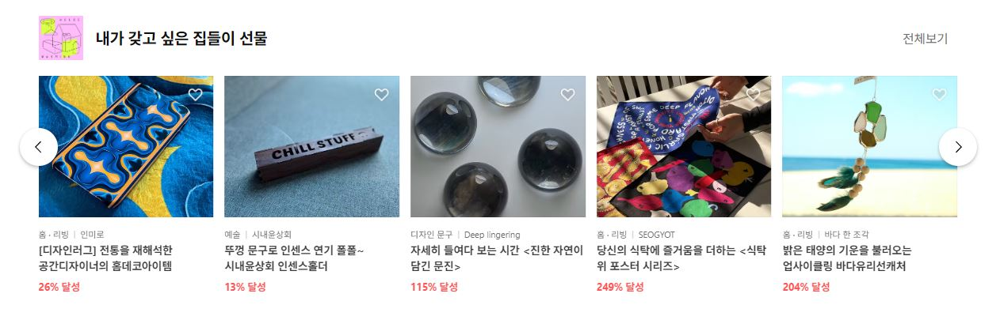
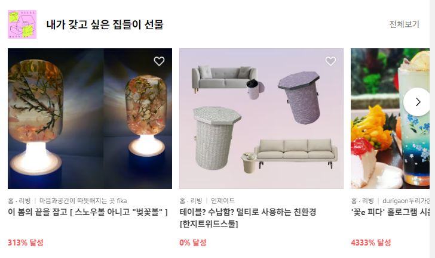

## 😀 2022.05.07.토

 

# ✨ CSS과제 회고

이번 CSS과제로 텀블벅 사이트를 클로닝 했다.  
그냥 보기에 바둑판처럼 단순한 구조인 것 같아서 쉽게 생각했는데 생각보다 생각보다 여려운 부분들이 있었다.  
html, css로 하려다보니 이미지 url과 text내용을 직접 입력해 주어야해서 번거로운 부분도 있었고, 반응형 부분에서 구현하기 까다로운 부분도 있었다.  
반응형으로 가로가 768px 보다 크면 5개의 제품이, 768px 보다 작으면 2.5개 이미지가 보이는 슬라이드가 있다. 제품 카드는 페이지 width에 따라서 달라진다. 

처음에 js로 width를 계산했었다 그런데 vw로 계산할 수있을 것 같아서 변경했다.  
1080px ~: 여기에서는 card사이즈를 동일하게 했다. 
1080 ~ 768px : calc(20vw - 20px)
~ 768px : calc(40vw - 28px)
전체 100vw에서 보여줄 카드의 갯수를 나눈vw를 적용한 다음 나머지는 카드 사이간격에 따라서 px을 마이너스 해주었다.  

