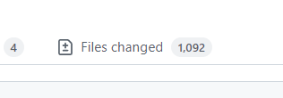

## 😀 2022.05.11.수

 

# ✨ 회고

- CSS 팀원 코드리뷰를 끝냈다. 형진님 코드리뷰를 할때 리뷰할pr에 이미지가 1000개가 들어가 있어서 github띄우는데 어려움이 있었다. 저렇게까지 이미지를 많이 넣을 일은 없지만 저렇게 코드가아닌 저렇게 static한 파일이 많이 들어갈 경우 그 파일만 미리 pr전에 올려두고 이후 pr을 날려서 코드리뷰를 받을 수 있다고 한다.  

- 오늘 Vue를 들으면서 eslint 설정을 했다. 계속 적용이 안되서 버전문제인가? 아니면 vscode문제인지 했는데 원인은 `.eslintrc.json`에 extends의속성으로 적었던 배열내부에 `"extends": ["eslint: recommended", "plugin: vue/vue3-recommended"],`이렇게 공백이 있었다. 같은 팀원 유현님이 알려주셔서 알았는데 혼자 찾았으면 못 찾았을 것 같다.  
공백에도 저렇게 민감할지 몰랐다. 다음에는 좀 더 주의해야겠다.  

- 오늘까지 Vue강의 밀린 것들을 다 들었다. 어제 까지만 해도 이전에 배웠던 문법들만 나와서 그렇게 어렵지 않았는데 오늘 처음 보는 문법이 등장했다. 이전것도 거의 많이 잊어버려서 새로배우는 기분인데 slot이 나오면서 헷갈리기 시작했다. 공식문서에 너무 자세히 내용이 나와있어서 내용 정리는 안하고 빠르게 강의 따라하면서 들으려고 했는데 그냥 따라만 하기에 머리속에서 헷갈려서 정리를 해야하나 싶었다. 우선은 notion부분까지는 쭉 들어보면서 눈에 익혀두고 그래도 헷갈리면 정리를 한 번 해야할 것 같다. 드디어 밀린게 해결되는 것 같아서 기분이 좋다.  

- 모던자바스크립트 class를 읽었다. 이제서야 함수형 프로그래밍에서 사용했던 proptype이 눈에 조금 들어온다. 음...아직 설명할만큼 잘 알지는 모르겠지만 조금씩 알것 같은 기분이 든다. 지금 절반정도 읽었는데 뒤에 언제 다 읽냐...😂 빨리 다 읽고 2회차 돌리고싶다. 다시 읽으면 이전에 이해하지 못했던 것들을 좀 더 잘 이해할 수 있을 것 같다.