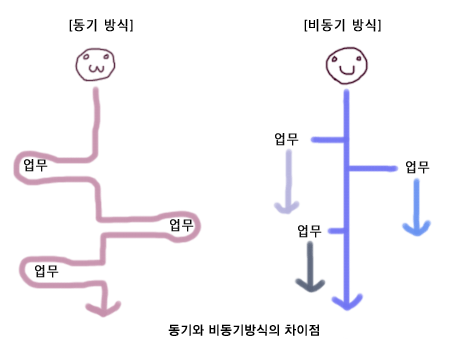
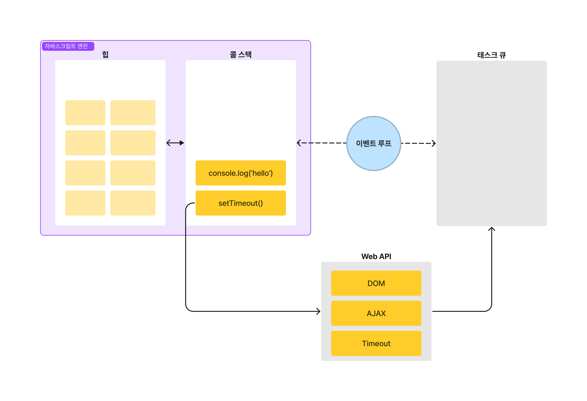

# 42장 비동기 프로그래밍

## 42.1 동기 처리와 비동기 처리

- 비동기
  : 작업이 순차적으로 하나씩 처리되는 방식이다.  
  그렇기에 순서가 보장된다는 장점이 있지만, 작업하나가 끝날때 까지 다른 작업들은 블로킹된다는 단점이 있다.
- 동기
  : 도시에 여러 작업이 처리되는 방식이다.  
  작업의 순서가 보장되지 않는다는 단점이 있다. 
  js에는 setTimeout, setInterval, HTTP요청, 이벤트 헨들러가 비동기로 처리된다. 

> 블로킹: 작업중단

## 42.2 이벤트 루프와 태스크 큐

js는 기본적으로 싱글스래드 언어이다. 이는 한번에 한 태스크만 처리된다는 것을 의미한다.  
하지만 실제 여러 사이트들을 보면 여러 동작을 동시에 하는 것 처럼 보인다.  
ex ) 애니메이션과 HTTP요청이 동시에 이루어지는 경우, 스크롤 시 다양한 효과들이 동작하는 경우 등..   
이런 동작이 가능한 이유는 이벤트 루프 덕분이다.  
이벤트 루프는 브라우저에 내장되어 있는 기능 중 하나이다. 

- 콜스택: 코드가 실행될 대 호출 스택이 쌓인다. 
- 힙: 객체가 저장되는 메모리 공간이다.
- 태스크 큐: 비동기 함수의 콜백함수, 이벤트 헨들러가 일시적으로 보관되는 영역이다. 
- 이벤트 루프: 콜스택에 실행중인 컨텍스트가 있으면 대기하고, 콜스택이 비어있다면 태스크 큐에서 대기중인 함수를 콜스택으로 이동시킨다.

js는 싱글 스레드 언어 이지만, 브라우저 상에서는 멀티 스레드로 동작한다. 