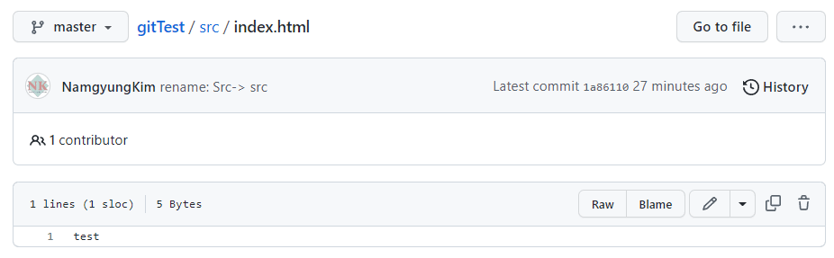

# 폴더명 변경
폴더명을 대문자로 작성해야하는데 간혹 잊어버리고 소문자로 만들어서 수정해야할 일이 있었다.  
이때 단순히 폴더명만 변경하면 git에서 인지하지 못하는 경우가 있다.  

## 방법1. 2번의 commit으로 변경
그래서 2번의 커밋을 통해 변경하고는 했다.  
1. 파일명을 아에 다른명으로 바꾼 후 commit을 한다. 
2. 다시 본래 파일명으로 바꾼 후 commit을 한다. 
그러나 이 방법은 불필요한 commit이 중간에 하나 더 생성되는 것 같아서 보기 좋지는 않았다.  

## 방법2. gitHub에서 변경

이렇게 변경하면 해당 파일에 한해서 경로가 변경된다.  
그러므로 해당 폴더 내부에있는 모든 파일의 경롤르 변경해주어야한다.  
이 과정에서 파일별로 commit이 생성된다.  
폴더 내부에 파일이 하나일 경우에는 괜찮겠지만 파일이 여러개일 경우 commit이 너무 많이 생겨서 보기 좋지 않다.  
그리고 vsCode에서 pull을해도 오른쪽과같이 대소문자를 구별한다.  

vscode에서 직접 변경해주어야한다.  

## 방법3. git mv 명령어 사용
mv는 파일명을 변경할때 이용되는 명령어이다.   
앞에 변경이전의 경로를 적고, 뒤에 변경이후 경로를 적으면 된다.  
```bash
git mv Src/index.html src/index.html
```
이 또한 Src 내부 파일별로 변경해주어야한다.  
또 변경해준다고 해도 vscode에서 폴더명을 별도로 변경해주어야한다.  
하지만 commit을 하나로 생성할 수 있어서 좋은 것 같다.  

셋다 썩 그렇게 마음에 다 들지는 않지만 그나마 방법3이 commit 메시지를 하나만 생성해서 좋은 것 같다.  