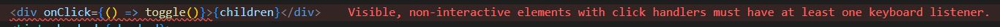

# non-interactive elements with click handlers must have at least one keyboard listener

## 오류내용

해당은 lint오류였다.  
div 태그에 onClick을 작성해서 오류가 났다.  
태그에 맞지 않는 이벤트를 사용해서 그러 것 같았다. 

https://github.com/jsx-eslint/eslint-plugin-jsx-a11y/blob/7f6463e5cffd1faa5cf22e3b0d33465e22bd10e1/docs/rules/no-static-element-interactions.md 




## 해결방법

1. 해당 동작과 맞는 태그를 사용한다.   
  div가 아닌 button컴포넌트를 사용한다던지...

2. div태그에 role추가 `<div className="foo" onClick={() => {}} role="button" />`

3. styled 컴포넌트를 사용하면 해당 lint에러가 발생하지 않았다.  
   ```js
    const component = () =>{
      return(
        <Box>
        </Box>
      )
    }

    const Box = styled.div`
      display: block;
      ...
    `
   ```