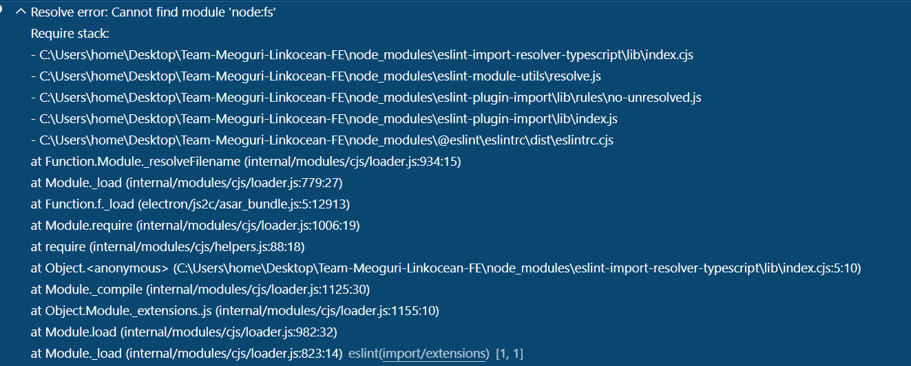

# vscode오류

프로젝트를 세팅하는데 내 컴퓨터에서만 `Resolve error: Cannot find module 'node:fs'` 이런 오류가 났다.

ts에서 난 오류인줄 알고 tsconfig도 변경해보고, npm i 도 다시여러번 해보고, node버전도 변경해보고, 다른 라이브러리도 설치해 봤는데 이 오류는 사라지지 않았다.  
결과적으로 vscode만 최신으로 업데이트해주니 해결이 되었다.  
이전에 vscode 최신에서 styled component오류가 있어서 업데이트를 막아뒀었는데 그 설정을 아직도 갖고있었고, 팀원분들 중에 나만 동작이 안됬던 거였다.  
vscode에서 오류가 있었을 거라고 생각도 못했는데 정말 세팅 다 맞췄는데 동작을 하지 않으면 vscode의 버전을 한번 바꿔서 실행해 봐야겠다.  

